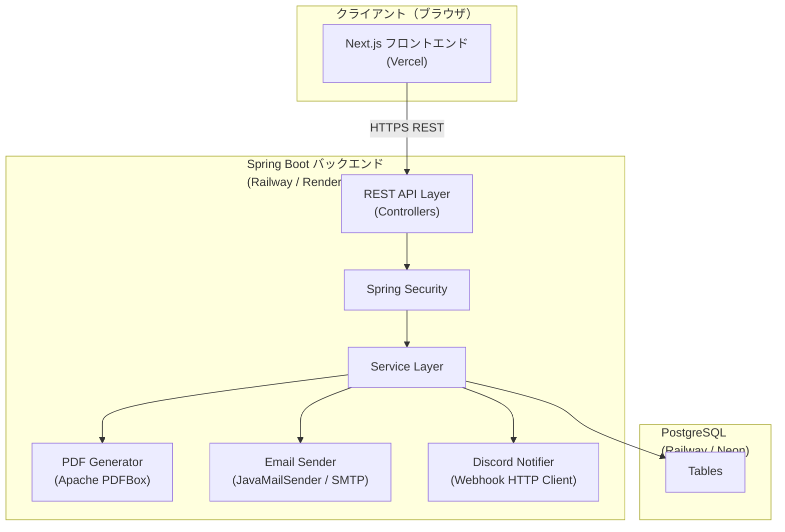
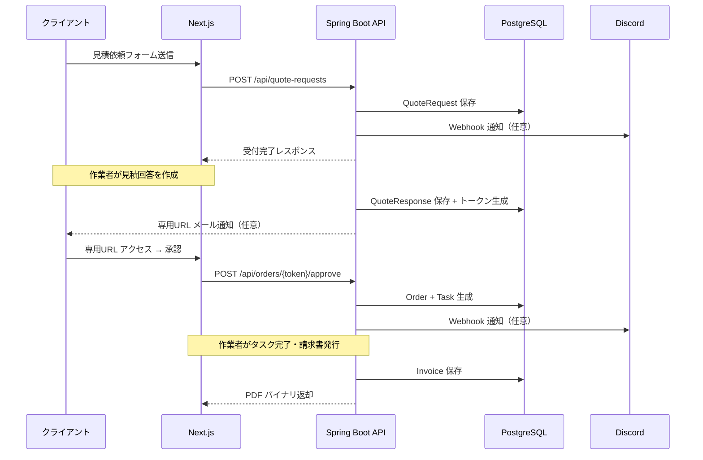
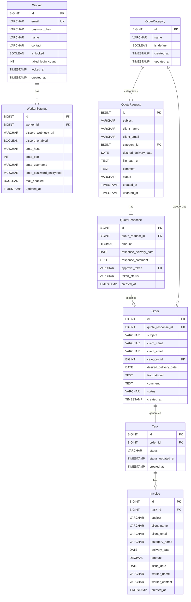

# 技術設計書 — FreelanceMusicCRM

## Overview

FreelanceMusicCRM は、フリーランス音楽クリエイターが案件受付から請求書発行までのライフサイクルを一元管理するための Web アプリケーションである。
作業者（クリエイター）は認証を経てダッシュボードにアクセスし、クライアントからの見積依頼受付・見積回答・正式依頼管理・タスク進捗管理・請求書発行を行う。
クライアントはログイン不要で見積依頼フォームにアクセスし、専用 URL で見積内容を確認・承認する。

### 設計方針

- **REST API による疎結合構成**：バックエンド（Spring Boot）とフロントエンド（Next.js）を分離し、REST API で通信する。
- **セキュリティファースト**：Spring Security によるセッション管理、CSRF 対策、JPA パラメータバインディングによる SQL インジェクション防止、React の自動エスケープによる XSS 対策を適用する。
- **無料枠での運用を考慮**：Railway または Render（バックエンド）、Vercel（フロントエンド）を想定。PostgreSQL free tier を使用する。
- **段階的な拡張性**：依頼区分マスタや通知先を管理画面から追加できる設計とする。

---

## Architecture

### システム全体図



### デプロイ構成

| コンポーネント | 技術                            | デプロイ先                 |
| -------------- | ------------------------------- | -------------------------- |
| フロントエンド | Next.js 14 (App Router)         | Vercel（無料枠）           |
| バックエンド   | Spring Boot 3.x (Java 21)       | Railway / Render（無料枠） |
| データベース   | PostgreSQL 15                   | Railway / Neon（無料枠）   |
| PDF 生成       | Apache PDFBox 3.x               | バックエンドに内包         |
| メール送信     | SMTP（Gmail / SendGrid 無料枠） | 外部 SMTP                  |

### メール送信ドメイン認証（DKIM/SPF）運用

要件 8.6（送信元メールアドレスの DKIM または SPF 認証）は、アプリケーションコードではなく送信ドメインの DNS とメールサービス設定で担保する。

1. 送信ドメインを確定する（例: `example.com`）。
2. 利用 SMTP サービス（Gmail Workspace / SendGrid / SES など）で DKIM キーを発行する。
3. DNS に `TXT` レコードを追加する。
   - SPF: `v=spf1 include:<provider> ~all` を設定
   - DKIM: SMTP サービスが提示する `selector._domainkey` の公開鍵を設定
4. SMTP 設定画面に、ドメイン認証済みの送信元メールアドレスを登録する。
5. 本番切替前に、テストメールを送信してヘッダで `SPF=pass` または `DKIM=pass` を確認する。

補足: バックエンドは TLS を強制して SMTP 送信を実行するため、通信路暗号化（要件 8.5）はアプリ側で満たす。

### フロー概要



---

## Components and Interfaces

### バックエンド — Spring Boot レイヤー構成

```
com.freelancemusiccrm
├── config/
│   ├── SecurityConfig.java          # Spring Security 設定 (CSRF, Session, BCrypt)
│   ├── WebMvcConfig.java            # CORS 設定
│   └── MailConfig.java              # JavaMailSender 設定
├── controller/
│   ├── AuthController.java          # POST /api/auth/login, POST /api/auth/logout
│   ├── QuoteRequestController.java  # POST /api/quote-requests, GET /api/quote-requests
│   ├── QuoteResponseController.java # POST /api/quote-responses, GET /api/quote-responses/{id}
│   ├── OrderController.java         # POST /api/orders/{token}/approve|decline
│   ├── TaskController.java          # GET/PATCH /api/tasks
│   ├── InvoiceController.java       # POST /api/invoices, GET /api/invoices/{id}/pdf
│   ├── OrderCategoryController.java # CRUD /api/order-categories
│   └── SettingsController.java      # GET/PUT /api/settings
├── service/
│   ├── AuthService.java
│   ├── QuoteRequestService.java
│   ├── QuoteResponseService.java
│   ├── OrderService.java
│   ├── TaskService.java
│   ├── InvoiceService.java
│   ├── PdfGeneratorService.java     # Apache PDFBox
│   ├── EmailSenderService.java      # JavaMailSender
│   └── DiscordNotifierService.java  # WebClient（非同期）
├── repository/                      # Spring Data JPA Repositories
├── entity/                          # JPA Entities
├── dto/                             # Request / Response DTOs
└── exception/                       # GlobalExceptionHandler (@RestControllerAdvice)
```

### REST API エンドポイント一覧

| メソッド | パス                                 | 説明                           | 認証 |
| -------- | ------------------------------------ | ------------------------------ | ---- |
| POST     | `/api/auth/login`                    | ログイン                       | 不要 |
| POST     | `/api/auth/logout`                   | ログアウト                     | 必要 |
| POST     | `/api/quote-requests`                | 見積依頼送信                   | 不要 |
| GET      | `/api/quote-requests`                | 見積依頼一覧                   | 必要 |
| GET      | `/api/quote-requests/{id}`           | 見積依頼詳細                   | 必要 |
| POST     | `/api/quote-responses`               | 見積回答作成                   | 必要 |
| GET      | `/api/quote-responses/token/{token}` | トークンで見積確認             | 不要 |
| POST     | `/api/orders/token/{token}/approve`  | 正式依頼承認                   | 不要 |
| POST     | `/api/orders/token/{token}/decline`  | 正式依頼辞退                   | 不要 |
| GET      | `/api/tasks`                         | タスク一覧（区分フィルタ対応） | 必要 |
| PATCH    | `/api/tasks/{id}/status`             | ステータス更新                 | 必要 |
| GET      | `/api/tasks/calendar`                | カレンダー用タスク（期間指定） | 必要 |
| POST     | `/api/invoices`                      | 請求書発行                     | 必要 |
| GET      | `/api/invoices/{id}/pdf`             | PDF ダウンロード               | 必要 |
| POST     | `/api/invoices/{id}/send-email`      | メール送信                     | 必要 |
| GET      | `/api/order-categories`              | 依頼区分一覧                   | 必要 |
| POST     | `/api/order-categories`              | 依頼区分追加                   | 必要 |
| PUT      | `/api/order-categories/{id}`         | 依頼区分更新                   | 必要 |
| DELETE   | `/api/order-categories/{id}`         | 依頼区分削除                   | 必要 |
| GET      | `/api/settings`                      | 設定取得                       | 必要 |
| PUT      | `/api/settings`                      | 設定更新                       | 必要 |

### フロントエンド — Next.js ページ・コンポーネント構成

```
app/
├── (public)/
│   ├── quote/page.tsx           # 見積依頼フォーム（クライアント向け）
│   └── orders/[token]/page.tsx  # 見積確認・承認ページ（クライアント向け）
├── (auth)/
│   └── login/page.tsx           # ログインページ
└── (dashboard)/
    ├── layout.tsx               # ダッシュボード共通レイアウト（ナビ）
    ├── dashboard/page.tsx       # ダッシュボード（KPI、最近の依頼）
    ├── quote-requests/
    │   ├── page.tsx             # 見積依頼一覧
    │   └── [id]/page.tsx        # 見積依頼詳細 + 見積回答フォーム
    ├── tasks/
    │   ├── page.tsx             # タスク一覧 + DetailPanel
    │   └── calendar/page.tsx    # カレンダービュー + DetailPanel
    ├── invoices/
    │   └── page.tsx             # 請求書一覧 + 発行
    ├── categories/page.tsx      # 依頼区分マスタ管理
    └── settings/page.tsx        # 設定（Discord Webhook, メール等）
```

**主要共通コンポーネント:**

| コンポーネント          | 役割                                         |
| ----------------------- | -------------------------------------------- |
| `<DetailPanel />`       | タスク詳細サイドパネル（右側スライドイン）   |
| `<TaskStatusBadge />`   | ステータスをカラーバッジで表示               |
| `<CalendarView />`      | 月/週切替カレンダー（react-big-calendar）    |
| `<QuoteRequestForm />`  | 見積依頼入力フォーム（バリデーション付き）   |
| `<InvoicePdfPreview />` | 請求書プレビュー                             |
| `<Navbar />`            | サイドナビゲーション（認証済みユーザー向け） |

---

## Data Models

### ER 図



### ステータス遷移

**QuoteRequest.status**

```
PENDING（受付中）→ RESPONDED（見積回答済）→ APPROVED（承認済）/ DECLINED（辞退）
```

**Task.status**

```
NOT_STARTED（未着手）→ IN_PROGRESS（進行中）→ COMPLETED（完了）/ CANCELLED（キャンセル）
```

**QuoteResponse.token_status**

```
ACTIVE（有効）→ USED（承認/辞退済）/ EXPIRED（期限切れ）
```

### 主要 DTO 定義

```java
// 見積依頼送信リクエスト
record QuoteRequestCreateDto(
    @NotBlank String subject,
    @NotBlank String clientName,
    @Email String clientEmail,        // optional
    @NotNull Long categoryId,
    @NotNull @Future LocalDate desiredDeliveryDate,
    @Pattern(regexp = "https?://.*") String filePathUrl,  // optional
    @Size(max = 1000) String comment
) {}

// タスクステータス更新
record TaskStatusUpdateDto(
    @NotNull TaskStatus status
) {}

// 見積回答作成
record QuoteResponseCreateDto(
    @NotNull Long quoteRequestId,
    @Min(0) BigDecimal amount,
    @NotNull LocalDate responseDeliveryDate,
    @Size(max = 1000) String responseComment
) {}
```

---

## Correctness Properties

_プロパティとは、システムの全ての有効な実行において成り立つべき特性や動作のことである。プロパティは人間が読める仕様とマシンが検証可能な正確性保証の橋渡しとなる。_

### Property 1: 認証結果の正確性

_任意の_ 入力（メールアドレス・パスワードのペア）に対して、有効な認証情報ならセッショントークンを返し、無効な認証情報ならセッショントークンを返さず認証エラーを返す。すなわち、認証成功と認証失敗は入力の有効性のみで決定される。

**Validates: Requirements 1.1, 1.2**

### Property 2: 未認証アクセスは常に拒否される

_任意の_ 保護済み API エンドポイントに対して、有効なセッショントークンを持たないリクエストは常に 401 レスポンスを返し、リソースへのアクセスを許可しない。

**Validates: Requirements 1.5, 11.6**

### Property 3: 必須フィールド欠落時のバリデーションエラー

_任意の_ 入力フィールドの組み合わせに対して、依頼件名・依頼者名・依頼区分・希望納期のいずれかが空または null のとき、見積依頼の送信は常にバリデーションエラーを返し、QuoteRequest レコードを生成しない。

**Validates: Requirements 2.2, 2.3**

### Property 4: 有効な見積依頼のラウンドトリップ保存

_任意の_ 有効な見積依頼データ（件名・依頼者名・区分・納期が全て有効）を送信したとき、生成された QuoteRequest を ID で取得した結果の全フィールドが送信データと一致する。

**Validates: Requirements 2.4**

### Property 5: URL フィールドのフォーマットバリデーション

_任意の_ 文字列をファイルパス URL フィールドに入力したとき、`http://` または `https://` で始まる有効な URL 形式のときのみ受け入れられ、その他の文字列はバリデーションエラーを返す。

**Validates: Requirements 2.5**

### Property 6: コメント文字数上限バリデーション

_任意の_ 長さのコメント文字列に対して、1000 文字以内の場合は受け入れられ、1001 文字以上の場合は常にバリデーションエラーを返す。

**Validates: Requirements 2.6**

### Property 7: 見積回答データのラウンドトリップ保存

_任意の_ 有効な見積金額（0 以上の整数）・回答納期・コメントを持つ見積回答を保存したとき、取得した結果の全フィールドが保存データと一致する。

**Validates: Requirements 3.2, 3.3**

### Property 8: QuoteRequest 1 件に対する QuoteResponse の一意性

_任意の_ QuoteRequest ID に対して、既に QuoteResponse が存在する場合に 2 件目の見積回答を作成しようとすると、常にエラーを返し、既存の QuoteResponse は変更されない。

**Validates: Requirements 3.4**

### Property 9: 承認トークンの一意性

_複数の_ 見積回答を生成したとき、各 QuoteResponse が持つ承認トークンは互いに異なる一意の値を持つ。

**Validates: Requirements 3.5**

### Property 10: 承認操作による Order・Task の一括生成とデータ完全性

_任意の_ 有効な承認トークンに対して承認操作を実行したとき、Order レコードと Task レコードが同時に生成され、Order のステータスが「受注済み」、Task のステータスが「未着手」となる。さらに、Order の全フィールド（件名・依頼者名・区分・納期等）が元の QuoteRequest・QuoteResponse データと一致する。

**Validates: Requirements 4.2, 4.3, 4.5**

### Property 11: 辞退操作で Task が生成されない

_任意の_ 有効な承認トークンに対して辞退操作を実行したとき、QuoteRequest のステータスが「辞退」に更新され、Task レコードは生成されない。

**Validates: Requirements 4.4**

### Property 12: Order の重複生成防止

_任意の_ 承認済みトークン（既に Order が存在する）に対して再度承認操作を実行したとき、常にエラーを返し、新たな Order は生成されない。

**Validates: Requirements 4.6**

### Property 13: Task ステータス変更の正確性と更新日時記録

_任意の_ Task に対して任意の有効なステータス（NOT_STARTED・IN_PROGRESS・COMPLETED・CANCELLED）への変更操作を実行したとき、変更後の Task の status が新しい値に更新され、status_updated_at が変更操作後の時刻に更新される。

**Validates: Requirements 5.1, 5.2**

### Property 14: 依頼区分フィルタリングの正確性

_任意の_ 依頼区分 ID でタスク一覧をフィルタリングしたとき、返された全てのタスクがその区分 ID に属し、他の区分のタスクは含まれない。

**Validates: Requirements 5.4**

### Property 15: カレンダー期間クエリの正確性

_任意の_ 期間（開始日・終了日）でカレンダー API を呼び出したとき、返されたすべての Task が指定期間内の希望納期を持つ。

**Validates: Requirements 6.2**

### Property 16: 依頼区分の CRUD ラウンドトリップ

_任意の_ 有効な区分名（1〜50 文字）を追加または更新したとき、区分一覧を取得した結果にその区分名が含まれ、取得した区分名が操作後の値と一致する。

**Validates: Requirements 7.2, 7.4**

### Property 17: 区分名文字数バリデーション

_任意の_ 長さの区分名文字列に対して、1 文字以上 50 文字以内のとき受け入れられ、0 文字または 51 文字以上のときはバリデーションエラーを返す。

**Validates: Requirements 7.3**

### Property 18: 使用中区分の削除拒否

_任意の_ Task に紐づいている区分 ID に対して削除操作を実行したとき、常にエラー（422）を返し、区分レコードは削除されない。

**Validates: Requirements 7.5**

### Property 19: Invoice データの完全性（ラウンドトリップ）

_任意の_ 有効な Invoice データを保存したとき、取得した結果の全フィールド（件名・依頼者名・区分・納品日・請求金額・発行日・作業者情報）が保存データと一致する。

**Validates: Requirements 8.2**

### Property 20: PDF 生成の有効性（日本語含む）

_任意の_ Invoice データ（日本語フィールドを含む）に対して PDF 生成を実行したとき、返却されたバイナリが有効な PDF フォーマット（`%PDF-` ヘッダーで始まる）であり、Invoice の主要フィールドのテキストを含む。

**Validates: Requirements 8.3, 8.4**

### Property 21: Invoice の重複発行防止

_任意の_ 既に Invoice が存在する Task ID に対して再度 Invoice 発行を試みたとき、常にエラー（409）を返し、新たな Invoice は生成されない。

**Validates: Requirements 8.7**

### Property 22: Discord 通知のトリガー確認

_任意の_ QuoteRequest 生成・Order 生成・Task 完了イベントが発生したとき、Discord 通知が有効な設定下では Webhook クライアントのメッセージ送信が必ず呼び出される。

**Validates: Requirements 9.1, 9.2, 9.3**

### Property 23: 通知失敗時のシステム継続性

_任意の_ Webhook 送信が失敗（例外スロー）しても、その親処理（QuoteRequest 保存・Order 生成・Task 更新）は成功し、システム全体の処理が中断されない。

**Validates: Requirements 9.4**

### Property 24: SQL インジェクション入力の安全な処理

_任意の_ SQL インジェクション試みパターン（`' OR '1'='1`、`; DROP TABLE` 等）をフォームフィールドに入力したとき、API は正常なバリデーションエラーまたは正常応答を返し、データベースエラーや意図しないデータ操作は発生しない。

**Validates: Requirements 11.2**

### Property 25: XSS 入力のエスケープ処理

_任意の_ スクリプトタグや HTML 特殊文字を含む文字列を入力フィールドに送信したとき、API レスポンスおよびデータベースに保存された値がエスケープされた形式となり、生の HTML タグとして解釈されない。

**Validates: Requirements 11.3**

---

## Error Handling

### グローバル例外ハンドラ

Spring Boot の `@RestControllerAdvice` を使用して、アプリケーション全体で一貫したエラーレスポンスを返す。

```json
{
  "timestamp": "2024-01-01T12:00:00Z",
  "status": 400,
  "error": "Bad Request",
  "message": "依頼件名は必須です",
  "path": "/api/quote-requests",
  "fieldErrors": [{ "field": "subject", "message": "依頼件名は必須です" }]
}
```

### エラーケースと HTTP ステータスコード

| シナリオ               | HTTP ステータス           | 対応方針                           |
| ---------------------- | ------------------------- | ---------------------------------- |
| バリデーションエラー   | 400 Bad Request           | フィールド別エラーメッセージを返す |
| 認証失敗               | 401 Unauthorized          | 詳細を開示しない汎用メッセージ     |
| 未認証アクセス         | 401                       | API は 401 を返す                  |
| アカウントロック       | 423 Locked                | ロック解除方法を案内               |
| リソース未発見         | 404 Not Found             | 汎用メッセージ（情報漏洩防止）     |
| 重複リソース作成       | 409 Conflict              | 既存リソースを示すメッセージ       |
| 削除拒否（使用中区分） | 422 Unprocessable Entity  | 「使用中の区分は削除できません」   |
| サーバー内部エラー     | 500 Internal Server Error | スタックトレースを外部に露出しない |
| Discord 通知失敗       | ログ記録のみ、処理継続    | 非同期化、フォールバック処理       |

### セキュリティエラー処理

- **認証失敗カウント管理**：Worker テーブルの `failed_login_count` で失敗回数を管理し、5 回超過で `is_locked = true` に設定する。
- **トークン検証**：不正・期限切れ・使用済みトークンはすべて 404 を返す（有効/無効の区別を外部に漏らさない）。
- **CSRF エラー**：Spring Security が 403 を返す。Next.js クライアントは Cookie から CSRF トークンを読み取り、リクエストヘッダーに付与する。

### 非同期処理とフォールバック

Discord 通知とメール送信は `@Async` + 専用スレッドプールで非同期実行し、失敗しても本体処理に影響しない。

```java
@Async
public void sendDiscordNotification(String message) {
    try {
        webClient.post().uri(webhookUrl)
            .bodyValue(Map.of("content", message))
            .retrieve().toBodilessEntity().block();
    } catch (Exception e) {
        log.error("Discord通知送信失敗: {}", e.getMessage());
        // システム処理を中断しない
    }
}
```

---

## Testing Strategy

### テスト全体方針

本プロジェクトでは以下の 3 層テスト戦略を採用する。

| テスト種別               | フレームワーク                    | 対象                                                |
| ------------------------ | --------------------------------- | --------------------------------------------------- |
| ユニットテスト           | JUnit 5 + Mockito                 | Service 層、バリデーション、ビジネスロジック        |
| プロパティベーステスト   | jqwik 1.8.x                       | 入力バリデーション、CRUD ラウンドトリップ、不変条件 |
| インテグレーションテスト | Spring Boot Test + Testcontainers | API エンドポイント、DB 連携                         |

フロントエンドテストは Vitest + React Testing Library を使用する。

### プロパティベーステスト（PBT）設定

- ライブラリ: **jqwik 1.8.x**
- 各プロパティテストの最小実行回数: **100 イテレーション**
- タグ形式: `@Tag("Feature: freelance-music-crm, Property N: <property_text>")`

各 Correctness Property を 1 つのプロパティベーステストで実装する。

```java
// 例: Property 6 — コメント文字数バリデーション
@Property(tries = 100)
@Tag("Feature: freelance-music-crm, Property 6: コメント文字数上限バリデーション")
void commentLengthValidation(
    @ForAll @StringLength(min = 0, max = 2000) String comment
) {
    var dto = new QuoteRequestCreateDto(
        "件名", "依頼者", null, 1L,
        LocalDate.now().plusDays(1), null, comment
    );
    var violations = validator.validate(dto);
    boolean hasCommentError = violations.stream()
        .anyMatch(v -> v.getPropertyPath().toString().equals("comment"));

    if (comment.length() <= 1000) {
        assertThat(hasCommentError).isFalse();
    } else {
        assertThat(hasCommentError).isTrue();
    }
}

// 例: Property 5 — URL フォーマットバリデーション
@Property(tries = 100)
@Tag("Feature: freelance-music-crm, Property 5: URLフィールドのフォーマットバリデーション")
void urlFormatValidation(@ForAll String url) {
    var dto = new QuoteRequestCreateDto(
        "件名", "依頼者", null, 1L,
        LocalDate.now().plusDays(1), url, null
    );
    var violations = validator.validate(dto);
    boolean hasUrlError = violations.stream()
        .anyMatch(v -> v.getPropertyPath().toString().equals("filePathUrl"));

    if (url == null || url.matches("https?://.*")) {
        assertThat(hasUrlError).isFalse();
    } else {
        assertThat(hasUrlError).isTrue();
    }
}
```

### ユニットテストの対象（例ベーステスト）

ユニットテストは以下の具体的なシナリオに集中し、過多にならないよう注意する。

- ログイン成功 / 失敗の具体的なシナリオ（要件 1.1, 1.2）
- アカウントロック（5 回失敗後）のシナリオ（要件 11.5）
- 完了タスクのみ Invoice 発行可能（要件 8.1）
- カレンダー API の月/週クエリパラメータ別レスポンス（要件 6.1）
- CSRF トークンなしのリクエストが 403 を返すこと（要件 11.4）
- 公開エンドポイント（見積依頼フォーム）が認証なしでアクセス可能なこと（要件 2.1）

### インテグレーションテスト

Testcontainers（PostgreSQL）を使用した API エンドポイントの結合テストを実施する。

- 見積依頼フロー全体（送信 → 回答 → 承認 → Task 生成）
- Invoice 発行から PDF ダウンロードまでの E2E フロー
- メール送信機能（JavaMailSender + TLS 設定、PDF 添付確認）

### スモークテスト

デプロイ後に実行する最小限の動作確認テスト。

- DB に初期 5 区分（作曲・ミックス・バンド演奏・楽譜作成・その他）が存在すること
- ログインエンドポイントが疎通すること
- セッションタイムアウト設定が有効であること
- CSRF 保護が有効であること
- SMTP 設定に TLS が有効であること

### フロントエンドテスト（Vitest + React Testing Library）

```
- QuoteRequestForm のバリデーション表示（必須フィールド欠落時のエラーメッセージ）
- TaskStatusBadge のステータス別カラークラス
- DetailPanel の開閉動作
- CalendarView の月/週切替
- CalendarView の完了/未完了タスクの CSS クラス差異
```

### テスト優先度

1. **必須（CI でブロック）**: プロパティベーステスト、インテグレーションテスト
2. **推奨**: ユニットテスト（ビジネスロジック）、フロントエンドコンポーネントテスト
3. **任意**: スモークテスト（ステージング環境）
